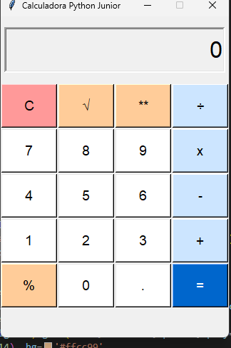
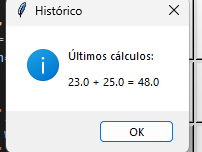
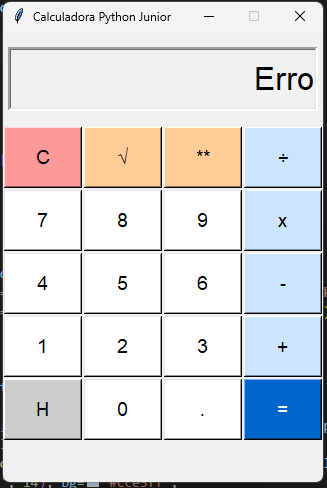

# 🧮 Calculadora Python - Nível Junior


**Calculadora completa com dupla interface desenvolvida em Python demonstrando fundamentos de programação procedural**

---

## 📋 Sobre o Projeto

Esta calculadora foi desenvolvida como projeto de portfólio para demonstrar domínio dos **conceitos fundamentais de Python** e **lógica de programação**. O projeto oferece **duas interfaces distintas** (terminal e gráfica) utilizando **programação procedural** com foco em código limpo e tratamento de erros.

### 🎯 Objetivo
Demonstrar capacidade de:
- ✅ Resolver problemas com lógica estruturada
- ✅ Implementar validações e tratamento de erros robusto
- ✅ Criar interfaces funcionais (terminal + GUI)
- ✅ Escrever código limpo e bem documentado
- ✅ Desenvolver aplicações com múltiplas interfaces

---

## ⚡ Funcionalidades

### 🔢 Operações Matemáticas
- **Básicas:** Soma, Subtração, Multiplicação, Divisão
- **Avançadas:** Potenciação, Raiz Quadrada, Porcentagem

### 🖥️ Dupla Interface
- **Terminal:** Menu interativo com navegação numerada
- **Gráfica:** Interface visual com botões estilo calculadora padrão

### 🛡️ Recursos de Segurança
- **Validação de entrada** para dados inválidos
- **Tratamento de erros** (divisão por zero, raiz negativa)
- **Sistema robusto** que continua funcionando após erros

### 📊 Recursos Extras
- **Histórico completo** de todos os cálculos realizados
- **Interface intuitiva** em ambas as versões
- **Limpeza de tela** para visual organizado (terminal)
- **Pop-up de histórico** na versão gráfica

---

## 🛠️ Tecnologias

- **Python 3.6+** - Linguagem principal
- **Tkinter** - Interface gráfica nativa do Python
- **OS Module** - Limpeza de tela multiplataforma
- **Exception Handling** - Tratamento robusto de erros

---

## 🚀 Como Executar

### Pré-requisitos
- Python 3.6 ou superior (Tkinter incluído por padrão)

### Instalação
```bash
# Clone o repositório
git clone https://github.com/Andre27031510/calculadora-python-junior.git

# Entre no diretório
cd calculadora-python-junior

# Execute
python calculadora_junior.py
```

---

## 📸 Screenshots

### Menu Principal

*Interface principal com todas as operações disponíveis*

### Realizando Cálculos

*Exemplo de operação matemática sendo executada*

### Histórico de Operações

*Visualização completa do histórico de cálculos*

### Tratamento de Erros

*Sistema robusto com validação e tratamento de erros*

---

## 🎨 Características Técnicas

### Interface Gráfica
- **Layout responsivo** com grid system
- **Cores organizadas** por tipo de operação
- **Display amplo** para melhor visualização
- **Botões intuitivos** com feedback visual

### Interface Terminal
- **Menu estruturado** com opções numeradas
- **Validação contínua** de entrada do usuário
- **Histórico persistente** durante a sessão
- **Navegação fluida** entre operações

### Arquitetura do Código
- **Funções bem definidas** com responsabilidades específicas
- **Variáveis locais e globais** gerenciadas adequadamente
- **Tratamento de exceções** em pontos críticos
- **Código limpo** seguindo boas práticas Python

---

## 👨💻 Autor

**André** - [GitHub](https://github.com/Andre27031510/calculadora-python-junior.git)

---

## 📄 Licença

Este projeto está sob a licença MIT - veja o arquivo [LICENSE](LICENSE) para detalhes.